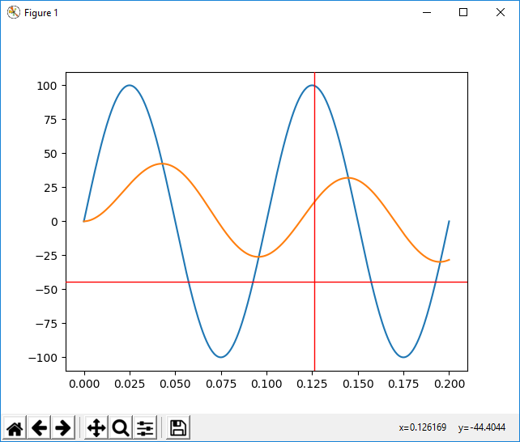
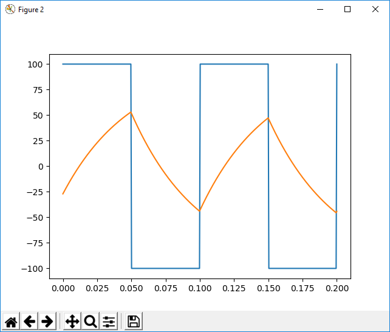
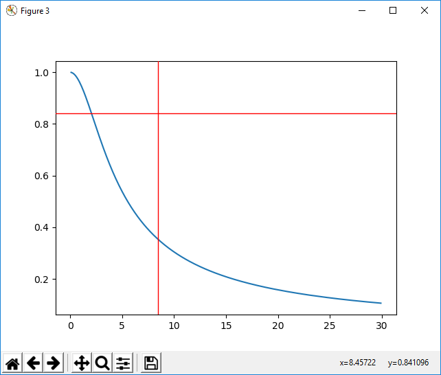

# filter-library
Filter library and tools for research and development in digital signal processing. Here is a bunch of simple filters iir, cic and moving average.
The lab folder contains some scripts for testing and debugging filter implementations.

### Prerequisites
- cmake
- python
- numpy
- scipy
- matplotlib

**How to run test**:
With python 3.7, matplotlib, numpy, scipy installed.

    cd lab
    mkdir build
    cd build
    cmake -G "MinGW Makefiles" ..
    cmake --build .
    cd ..
    python iir1_lab.py

As a result, appears iir1 filter responses for sinusoidal and meander signals:

and frequency response:

